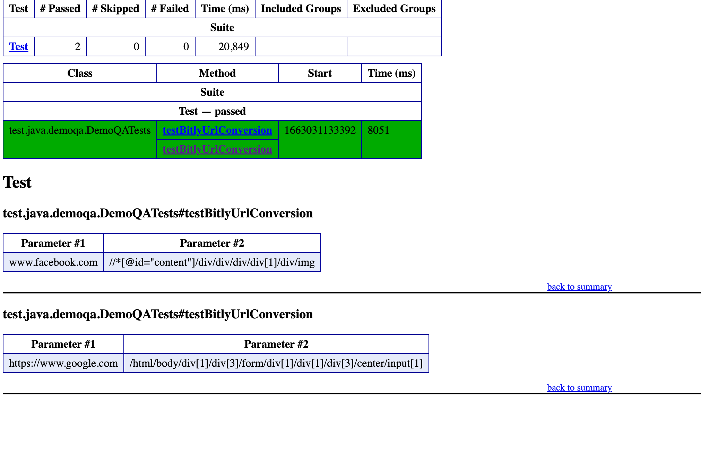

# Description
* This is a java Selenium test project developed for testing bitly happy case functionality
* This project uses page object pattern to avoid tests being too sensitive to UI changes.
* This project uses data driven approach in order to keep data separate from functional test logic and to aid with quick scaling.
* This project uses testNG test framework for its sophisticated features such as html run reports, ability to group and prioritize tests, parallel testing, data parameterization.
* This project is built using maven tool.

To run the tests, goto project root directory and run "mvn clean install test"

# Test cases included:
1. Convert url in bitly
2. Verify that the bitly url takes to respective destination

# How to run
Prerequisite: 
1. maven
2. java

test run command: mvn -e clean install test

# Docker as another option
Prerequisite: please install docker and run it.

```
sh dockerrun.sh
```
For  CI/CD integration, please use the docker image and run it


# Test run results - testng html report


# Further enhancements

- [ ] Include clicking link from the bitly page
- [ ] Include negative case
- [ ] Convert this to BDD with Cucumber if BDD is needed
